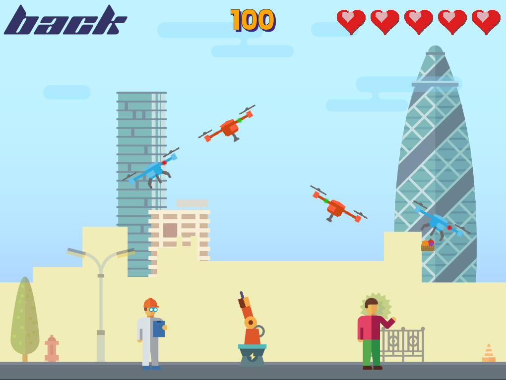

# Attack of the Drones 🚁

Um jogo de ação 2D no estilo arcade em que o jogador defende civis de ondas de drones invasores em um cenário urbano. Desenvolvido originalmente para iOS (Cocos2d / Swift) e migrado para **Godot 4**, com exportação para **Web (HTML5)**.

---

## Screenshots

### Tela Inicial


### Gameplay


---

## Como Jogar

- **Clique / Toque** em qualquer ponto da tela para apontar e disparar a arma na direção do alvo.
- **Destrua os drones** antes que eles atirem nos pedestres que caminham pela calçada.
- **Intercepte os projéteis inimigos** no ar para ganhar pontos extras.
- Se todos os seus corações acabarem, o jogo termina. Toque para voltar à tela inicial.

---

## Mecânicas de Jogo

| Elemento | Descrição |
|---|---|
| ❤️ Vidas | Começa com **5 vidas**. Cada pedestre morto por um projétil inimigo remove 1 vida. |
| 🎯 Pontuação | Drone destruído **+100 pts** · Projétil inimigo interceptado **+50 pts** |
| 🚁 Drones | Surgem a cada ~2 s pela esquerda ou direita, em alturas aleatórias, e atiram nos pedestres. |
| 🚶 Pedestres | Caminham pela calçada a cada ~2 s. Se atingidos por um projétil inimigo, o jogador perde uma vida. |
| 🔫 Arma | Posicionada na calçada, rotaciona suavemente em direção ao ponto clicado e dispara a **700 px/s**. |
| 💥 Game Over | Com 0 vidas, os inimigos congelam, surge uma sobreposição e o jogador pode voltar ao menu. |

---

## Controles

| Plataforma | Ação |
|---|---|
| Desktop | Clique com o botão esquerdo do mouse |
| Mobile / Tablet | Toque na tela |

---

## Configurações

Acessível pelo ícone de ajustes (⚙️) na tela inicial:

- **Música de fundo** — ligar / desligar
- **Efeitos sonoros** — ligar / desligar

---

## Tecnologia

- **Engine:** Godot 4 (GDScript)
- **Exportação:** HTML5 / Web
- **Origem:** Migrado de Cocos2d / Swift (iOS)
- **Física:** Motor 2D nativo do Godot (985 px/s² de gravidade)
- **Áudio:** `AudioStreamPlayer` do Godot

### Estrutura dos arquivos web

| Arquivo | Descrição |
|---|---|
| `index.html` | Página principal do jogo |
| `index.js` | Runtime JavaScript do Godot |
| `index.wasm` | Módulo WebAssembly do motor |
| `index.pck` | Pacote com os assets e cenas do jogo |
| `index.audio.worklet.js` | Worklet de áudio para Web |
| `index.icon.png` | Ícone do jogo |

---

## Como Executar Localmente

Por restrições de segurança do navegador, o jogo precisa ser servido via servidor HTTP (não pode ser aberto diretamente como arquivo).

```bash
# Python 3
python -m http.server 8080
```

Acesse `http://localhost:8080` no navegador.

---

## Créditos

Desenvolvido por **Mauricio Dantas** · [mauricio@mdantas.net](mailto:mauricio@mdantas.net)
